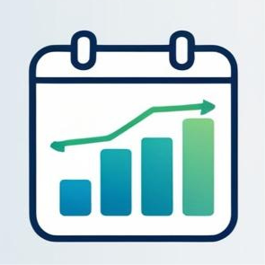

# Meeting Optimizer Chrome Extension



A Chrome extension that automatically preloads meeting links before scheduled meetings start. This extension helps you prepare for online meetings by opening video conference links in background tabs a few minutes before the meeting begins.

## Features

- **Calendar Integration**: Connects to your Google Calendar to monitor upcoming meetings
- **Meeting Link Detection**: Automatically extracts video conference links from calendar events (supports Google Meet, Zoom, Microsoft Teams)
- **Configurable Settings**: Choose how many minutes before a meeting to open the link
- **Auto-Close**: Optionally close meeting tabs after the scheduled end time
- **Meeting Overview**: See all your upcoming meetings with video links in the popup

## Installation

### From Source Code

1. Clone the repository:

   ```
   git clone https://github.com/rishikesh-suvarna/meeting-optimizer-chrome-extension.git
   ```

2. Set up OAuth credentials:

   - Create a project in the [Google Cloud Console](https://console.cloud.google.com/)
   - Enable the Google Calendar API
   - Create OAuth 2.0 credentials for a Chrome extension
   - Set the application type to "Chrome App" and enter your extension ID
   - Download the client credentials

3. Create a `manifest.json` file:

   - Copy `manifest.example.json` to `manifest.json`
   - Replace `YOUR_CLIENT_ID.apps.googleusercontent.com` with your actual client ID

4. Load the extension in Chrome:
   - Open Chrome and go to `chrome://extensions/`
   - Enable Developer Mode
   - Click "Load unpacked" and select the extension directory

## Setup

After installing the extension:

1. Click the extension icon in your browser toolbar
2. Click "Connect to Google Calendar"
3. Grant the necessary permissions to access your calendar
4. Configure your preferences in the Settings tab

## Configuration Options

- **Open meeting links**: Choose how many minutes before the meeting to open tabs (1, 3, 5, or 10 minutes)
- **Automatically close meeting tabs**: Enable or disable auto-closing of tabs after meetings end

## Development

### Prerequisites

- Google Cloud account
- Chrome browser

### Local Development

1. Follow the installation steps above
2. Make your changes to the code
3. Reload the extension in Chrome to test changes

### Building for Production

For production use, you might want to package the extension:

1. Ensure all files are properly configured
2. Create a ZIP file containing all necessary extension files
3. The extension can be submitted to the Chrome Web Store or distributed privately

## Privacy

This extension:

- Only accesses calendar data to detect meeting links
- Does not store or transmit your calendar data outside your browser
- Only opens tabs for meetings with video conference links

## Troubleshooting

- **Authentication issues**: Ensure you've properly set up the OAuth credentials and added yourself as a test user
- **Meeting links not detected**: Check that your meeting invites include standardized conference links
- **Extension not working**: Verify that you've granted calendar permissions and that the extension is enabled

## License

[MIT License](LICENSE)

## Contributing

Contributions are welcome! Please feel free to submit a Pull Request.
